# Obsidian Security — Company Profile Website

A responsive, multi-page company profile website for **Obsidian Security**, a fictional cybersecurity company, built with Laravel's MVC architecture as part of **ITST 302 – Client-Server Technologies, Week 3 Mini Project 02**.

**Stack:** Laravel 13, Blade Templating Engine, Tailwind CSS
**Repository:** `week03-company-profile`

---

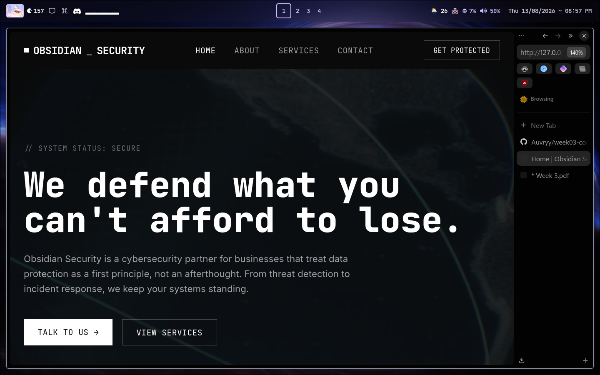

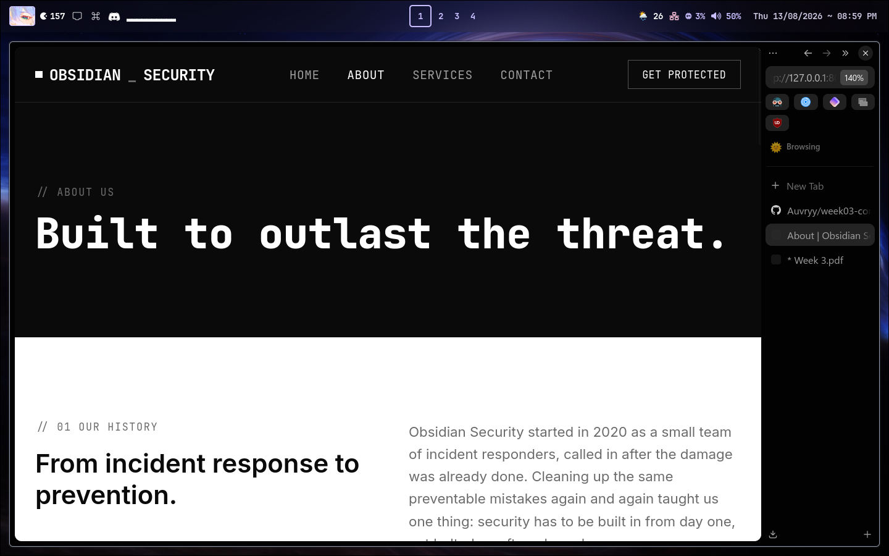

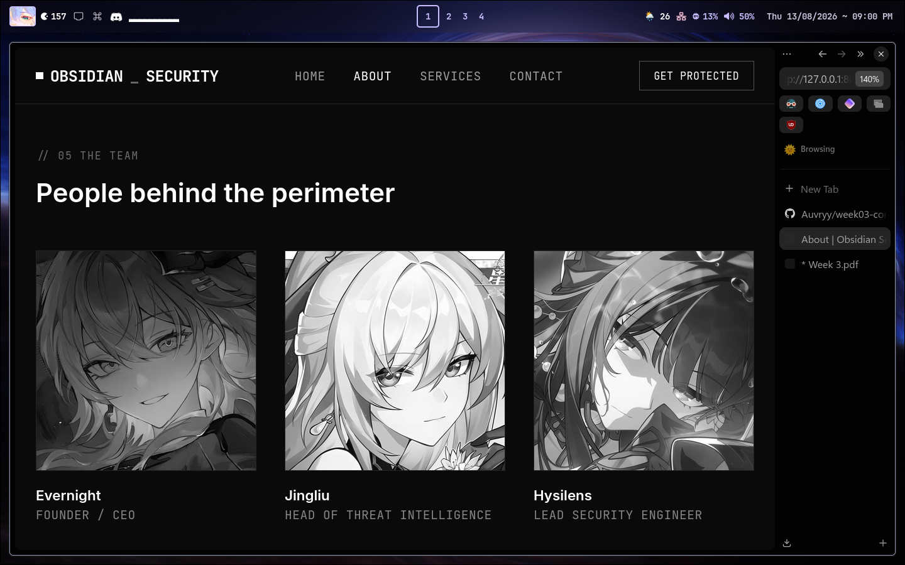

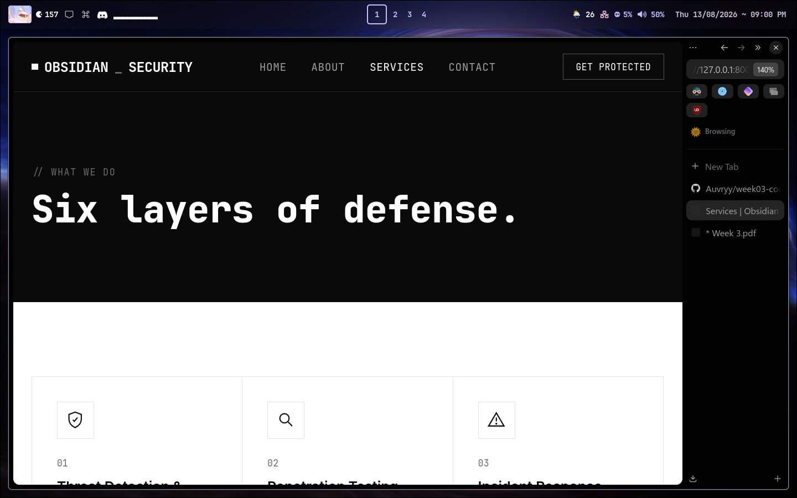

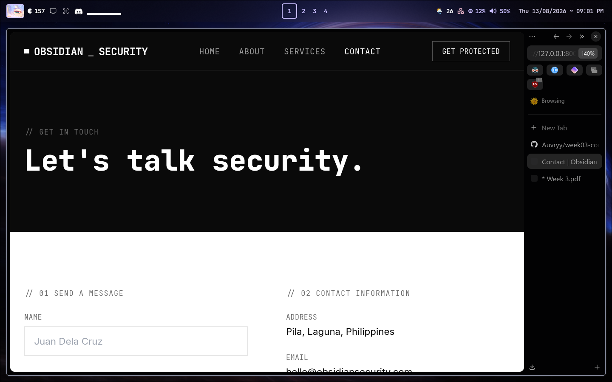

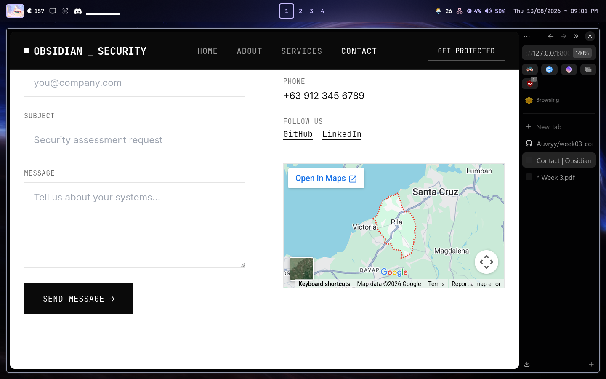

---

## 1. Introduction

A company profile website is basically the official online home of a business. Instead of people only finding you through social media, this is a place where the company controls everything, how it looks, what it offers, and how people can get in touch.

Businesses need one because for a lot of clients this is the first thing they see before they even talk to anyone. A clean and professional looking site already builds trust before the actual conversation even starts.

For this project the goal was to build a company profile site for a cybersecurity company i made up called Obsidian Security, while also learning how Laravel actually works using MVC. The point wasn't just to make something that looks good, it was more about understanding how a request travels from the browser, into a route, then a controller, then a blade view, then back out as the page you actually see.

## 2. Objectives

By the end of this project, i was able to:

- Understand and apply the MVC architecture using Laravel
- Create and organize multiple routes in `routes/web.php`
- Build a controller (`CompanyController`) that handles all four pages
- Use Blade to build a reusable layout and shared components like the navbar and footer
- Build four fully responsive pages, Home, About, Services, and Contact
- Use git properly with meaningful commits along the way
- Document everything in this README
- Get the project ready for GitHub and LinkedIn

## 3. MVC Architecture

MVC stands for Model View Controller. It's basically a way of splitting an app into three parts so things don't get mixed together. The model handles the data and the logic behind it, the view is what the user actually sees, and the controller sits in between, it takes the request and decides what should happen and which view to send back.

Laravel uses MVC because it keeps everything separated instead of cramming logic and html into the same file. Without that separation, the code gets really messy and hard to manage once the project grows past a few pages.

Some advantages of MVC in general:

- Everything has its own job, so it's easier to find where a problem actually is
- You can reuse things like layouts and components instead of copy pasting the same code over and over
- It makes the codebase easier to scale since routes, logic, and presentation aren't fighting for the same space

Here's a simple diagram of how a request flows through this project:

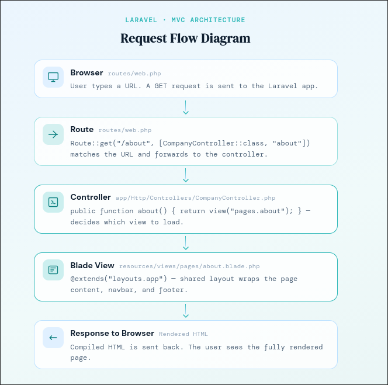

## 4. Laravel Routing

Routing is basically how Laravel knows what to do when someone visits a certain url. So when someone goes to `/about`, Laravel checks `routes/web.php` to see what should happen for that specific url. If there's no route defined for it, it just throws a 404.

All four routes in this project use `Route::get()` since every page here is just being viewed, there's no data being submitted or changed, the user is just requesting to see a page.

**Routes used in this project:**

```php
use Illuminate\Support\Facades\Route;
use App\Http\Controllers\CompanyController;

Route::get('/', [CompanyController::class, 'home']);
Route::get('/about', [CompanyController::class, 'about']);
Route::get('/services', [CompanyController::class, 'services']);
Route::get('/contact', [CompanyController::class, 'contact']);
```

Each route doesn't render the view directly, it just hands that job off to the controller, which keeps `web.php` short and easy to read.

Named routes weren't really needed for a project this small, but Laravel does let you attach a name to a route and call it later using `route('name')` instead of hardcoding the url everywhere. That becomes more useful once the site grows bigger and urls start changing.

## 5. Controllers

A controller is basically where the logic for handling a request goes, instead of putting everything directly inside the routes file. `CompanyController` handles all four pages in this project, and its only job is to tell Laravel which view to return for each route.

Why controllers are useful:

- Keeps `routes/web.php` short and clean
- Groups all the related logic in one place instead of scattering it around
- Makes it easy to add more logic later, like passing data to a view, without touching the routes at all

**Controller methods:**

```php
class CompanyController extends Controller
{
    public function home()
    {
        return view('pages.home');
    }

    public function about()
    {
        return view('pages.about');
    }

    public function services()
    {
        return view('pages.services');
    }

    public function contact()
    {
        return view('pages.contact');
    }
}
```

Each method just returns a `view()` call, pointing to the matching Blade file inside `resources/views/pages/`.

## 6. Blade Templating Engine

Blade is Laravel's templating engine. It takes directives like `@extends` and `@section` and compiles them into regular PHP behind the scenes, so the views stay readable while still being able to do loops, conditionals, and shared layouts.

**Blade Layouts** — `resources/views/layouts/app.blade.php` is the master layout for the whole site. It holds everything that's shared across every page, the head tag, fonts, tailwind config, the navbar, the footer, and one `@yield('content')` spot where each page's own content gets dropped in.

**Blade Components** — `resources/views/components/navbar.blade.php` and `footer.blade.php` are anonymous Blade components. Since they're inside `resources/views/components/`, Laravel automatically picks them up, so they can just be used anywhere as `<x-navbar />` and `<x-footer />` without registering them manually.

**`@extends`** — used at the top of every page to say which layout it's built on top of:

```php
@extends('layouts.app')
```

**`@section` / `@endsection`** — wraps a page's own content and gives it a name that matches the layout's yield:

```php
@section('content')
    <!-- page content here -->
@endsection
```

**`@yield`** — used in the layout to mark exactly where a section's content should go:

```php
@yield('content')
```

**`@include`** — another way to pull one Blade file into another, like `@include('components.navbar')`. This project uses `<x-navbar />` instead, which does the same job through Laravel's component system.

## 7. Laravel Folder Structure

| Folder | Purpose |
|---|---|
| `app/` | Application code, controllers, models, and providers. `CompanyController` lives inside `app/Http/Controllers/`. |
| `routes/` | Defines how urls map to controllers. `web.php` holds all the routes for this project. |
| `resources/` | All the uncompiled front end stuff, every Blade view (`layouts/`, `components/`, `pages/`), CSS, and JS. |
| `public/` | The entry point for the site. Holds `index.php` and public assets like `images/` and `videos/` used in this project. |
| `bootstrap/` | Files that bootstrap the whole Laravel app and cache framework level stuff. |
| `config/` | Config files for the app, database, mail, services, and so on, each one just returning a php array of settings. |

## 8. Screenshots

### Home Page
Code:
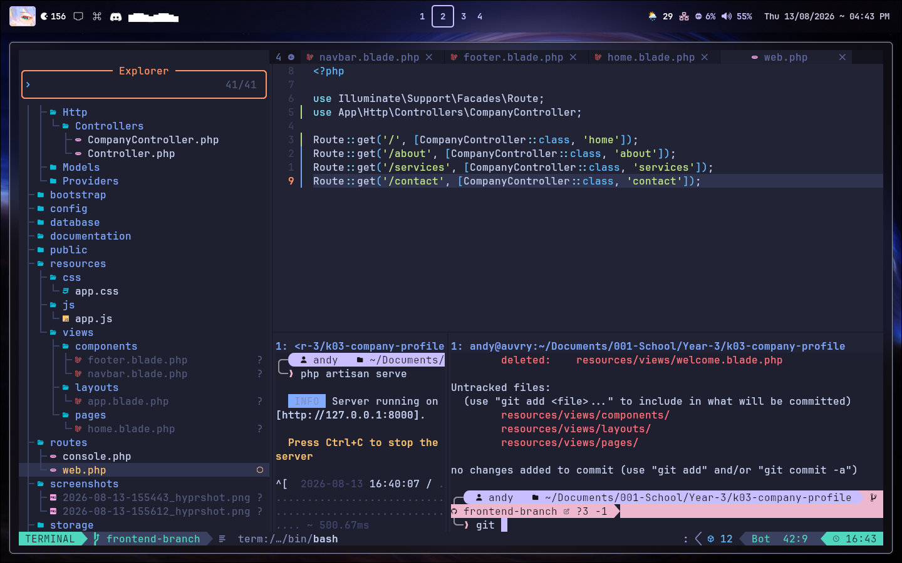

### About Page
Code:
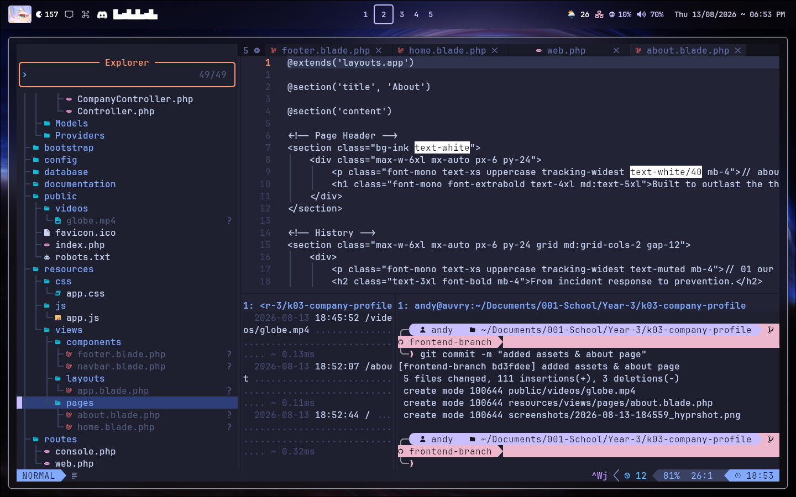

### Services Page
Code:
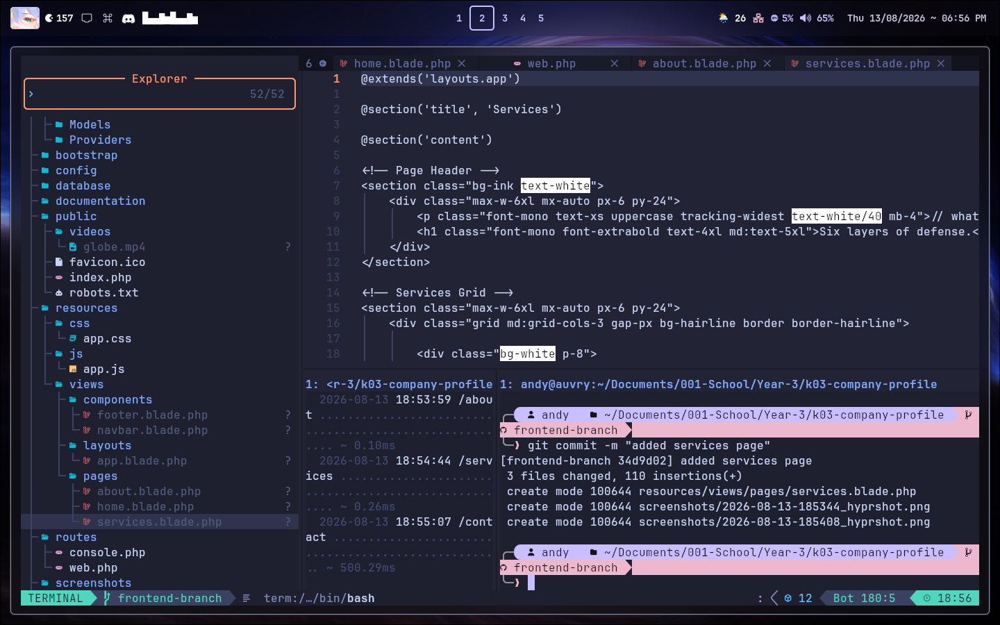

### Contact Page
Code:
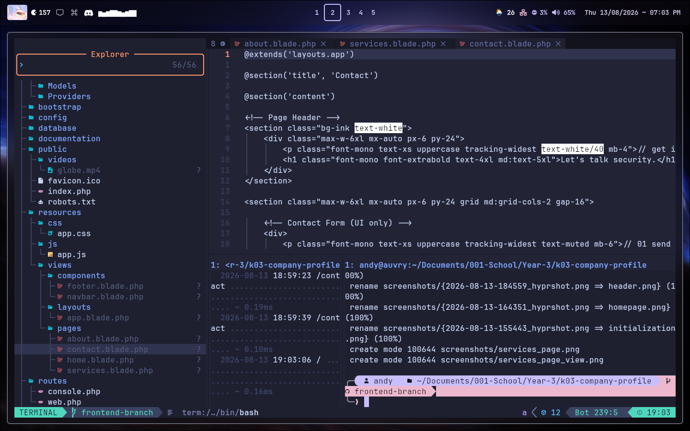

### Navigation Bar


### Footer
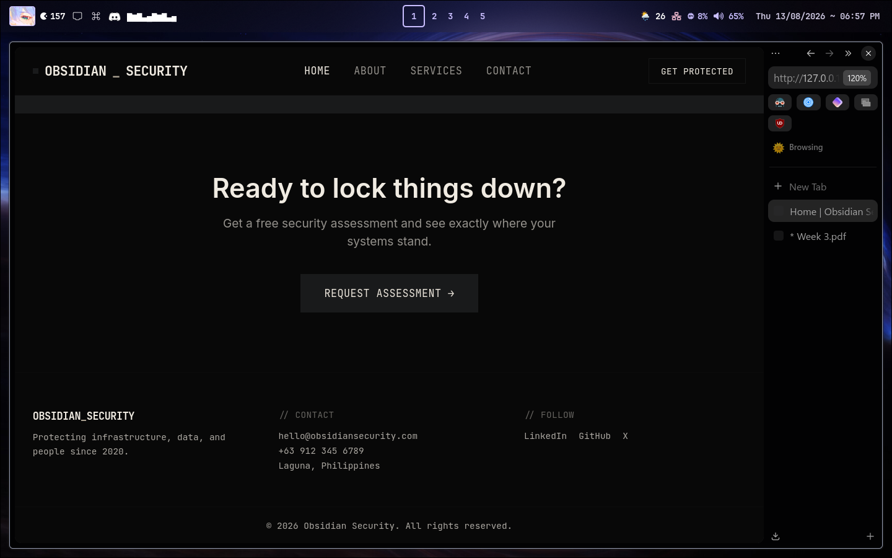

### Route Definitions
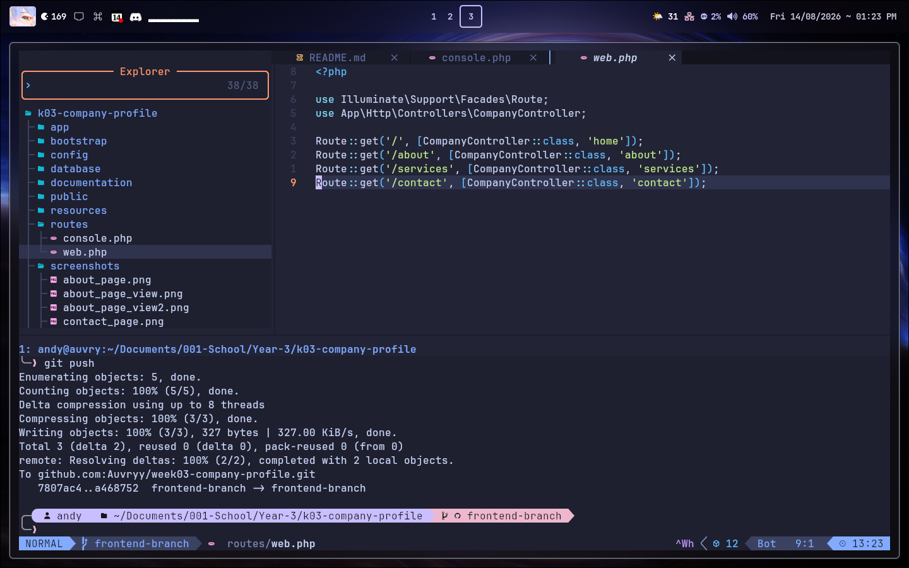

### Controller


### VS Code Project / Folder Structure
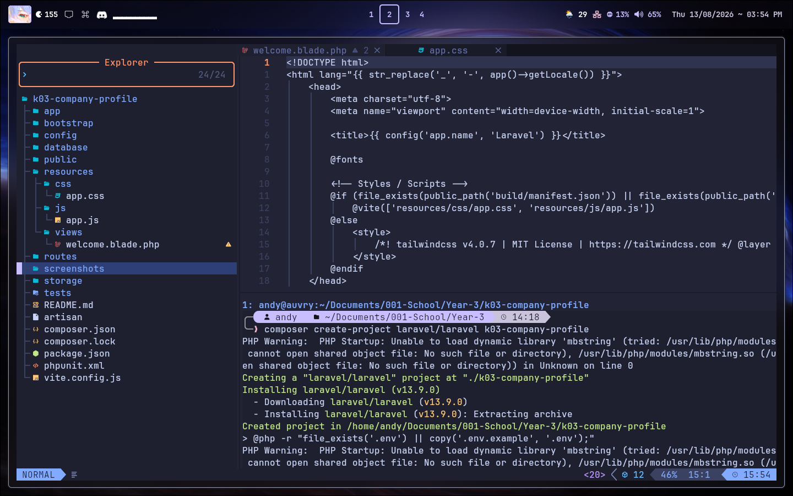

### GitHub Repository
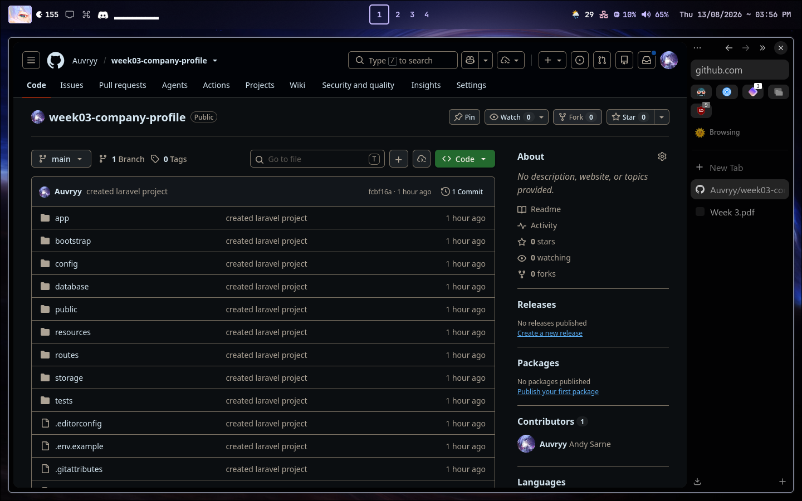

## 9. Problems Encountered

1. **`View [welcome] not found` error.** After deleting Laravel's default `welcome.blade.php`, the site immediately threw a 500 error, since `routes/web.php` was still pointing to that deleted view through the original closure based route.

2. **`ArgumentCountError` on `Illuminate\Foundation\Vite`.** The layout's head section crashed with "too few arguments to function Vite::__invoke()". Turns out it wasn't actually a Vite problem, it came from an HTML comment in the layout that had the literal text `@vite` written in it. Blade scans the whole file for `@directive` patterns, even inside comments, so it compiled that stray text into a real (and broken) `@vite()` call.

3. **Keeping the wrapper divs balanced when adding the hero video.** Adding an absolutely positioned background video and overlay inside the hero section meant adding an extra wrapping div around the existing content, without messing up the closing tags that were already there.

## 10. Solutions

1. Updated the `/` route to point to `CompanyController::class, 'home'` instead of the deleted `welcome` view, matching it to the already built `pages/home.blade.php`.

2. Escaped the `@` in the comment by writing it as `@@vite`, which tells Blade to treat it as plain text instead of a directive, then cleared the compiled view cache with `php artisan view:clear`.

3. Added one `relative` wrapper div around the hero's inner content so it would sit properly above the video and overlay, then double checked every div that was opened actually had a matching closing tag before the section ended.

## 11. Reflection

Doing this project honestly helped me understand MVC a lot better than just reading about it in the module. Before this i knew the definition, model view controller, but i didn't really get why the separation actually mattered. Once i started adding things like the background video on the hero section, i realized i only had to touch the home page file. The layout, navbar, footer, controller, and routes didn't need any changes at all. That's when it actually clicked why separation of concerns is useful and not just a term from the lecture.

Separation of concerns matters because it keeps changes contained to one place. If everything was mixed together in one file, even something small like changing a button color could accidentally break something completely unrelated, like how a route resolves. Keeping `web.php` only for routes, the controller only for deciding which view to load, and blade files only for the actual markup made it a lot easier to edit one thing without worrying about breaking something else.

I also started understanding how routes, controllers, and views actually work together instead of just being three separate topics to memorize. A page doesn't just appear on its own, it has to be matched by a route first, then handed off to the right controller method, and only then does that controller return a view, which itself depends on the shared layout and components. Once i understood that whole chain, debugging got a lot less confusing. Like when i hit that Vite error, i didn't just guess randomly, i actually traced it back to the layout file since that's where the head section gets rendered before anything else even loads.

I think this kind of setup can scale up way bigger than this four page project. In an actual enterprise system there'd probably be a lot more controllers handling different sections, models connecting to a real database instead of just returning static blade views, and the same idea of reusable layouts and components would still apply, just on a much bigger scale, like an admin panel or a dashboard shared across a lot of internal pages. The core idea stays the same either way, keep the logic, the data, and the way things look separated so the whole thing doesn't turn into one giant file that's impossible to touch without breaking something.

Overall this project made MVC go from something i could just define to something i actually get the point of now.

## 12. References

Laravel. (2025). *Laravel 11.x documentation*. Laravel. https://laravel.com/docs

Mozilla Developer Network. (2025). *MDN Web Docs*. Mozilla. https://developer.mozilla.org/

PHP Group. (2025). *PHP manual*. The PHP Group. https://www.php.net/docs.php

Tailwind Labs. (2025). *Tailwind CSS documentation*. Tailwind Labs. https://tailwindcss.com/docs

---
Disclaimer: The background video and character images used (Evernight, Jingliu, and Hysilens from Honkai: Star Rail) are not my own and belong to their respective owners. Used purely for educational purposes as part of a school project, no copyright infringement intended, and this project is not for sale or commercial use.

**GitHub:** [github.com/Auvryy](https://github.com/Auvryy)
**LinkedIn:** [linkedin.com/in/andy-sarne](https://www.linkedin.com/in/andy-sarne/)
